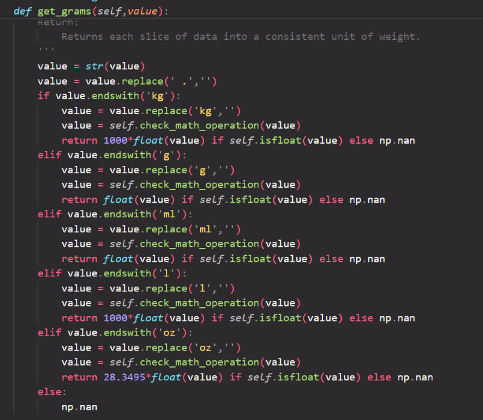

# Multinational Retail Data Centralisation

In this project we create a postresql database locally, then create multiple classes to create, process and clean the data from various sources, and then run sql queries to imitate real life scenarios. My aim in this project is to learn how to retieve data from various locations and to get an understanding of multiple data types, creating relevance in applying these skills in real world applications.
So far I now have a greater understanding of python classes and its capabilities in turning complex code into something quite simple. I have also learnt how to connect data from vs code to pgadmin, in addition as a result of pursuing this project I now have a good amount of knowledge on regular expressions, tabula-py and boto3 libraries.

Key technologies used are python, AWS(S3), pandas, sqlalchemy, yaml, json, tabula-py, regex, numpy, boto3 and botocore.

## Project Modules

1. Database_Utils: In the 'database_utils.py' file we establish the connection between the database and the local host using the credentials within the yaml file.

2. Data_Cleaning: In the 'data_cleaning.py' file we convert the table to a dataframe and start cleaning the data using the pandas library. Looking out for any anomilies and extracting any null values within the table.

3. Data_Extraction: In the 'data_extraction.py' file we extract data from multiple locations, e.g. AWS S3, and extract the data from there to then clean said data.

## Data Processing Steps

There are 6 sources of data retrieved.

1. The "dim_card_details" was retrieved from the AWS cloud via a PDF file. We used tabula-py to read the file and concatenated it to become a pandas dataframe. We then cleaned all the anomalies and uploaded it to the local host. The card number was used as a primary key as it is the only unique set of numbers in that table.

2. The "dim_store_details" was collected by the get method using an API. We used the request to retrieve the data from the AWS cloud and saved it in a json format. The data was cleaned making sure it was all in correct formats, then uploaded to the local host. The "store_code" was used as the primary key.

3. The "dim_products" was extracted from an S3 bucket from the cloud using the boto3 library, using response and status to let me know it has worked. It was then put into a json format, then converted to pandas dataframe. The data was again cleaned and uploaded to the local host. The product code was used as a primary key.

4. The "dim_users" table was retreived via a set of credentials from the AWS cloud. The credentials was stored inside a yaml file and called upon initalising the engine and listing said table. No external libraries were used apart from pandas when converting to a dataframe. The data was again cleaned then uploaded to the local host. The user_uuid was used as a primary key as it was unique to the table.

## Data Cleaning Notes

In the steps following the cleaning, I took certain procedures in making sure all the data that went through my pipeline was correct. The first process was getting rid of all null values. I accounted for multiple versions of null, for example NaN and NA. I also made sure I had converted all of them from strings to the actual data type. Secondly I had made sure columns like dates and emails were all in the correct format. Finally I made sure that the weights were all in the same unit of measurement.

### Examples Of The Cleaning

